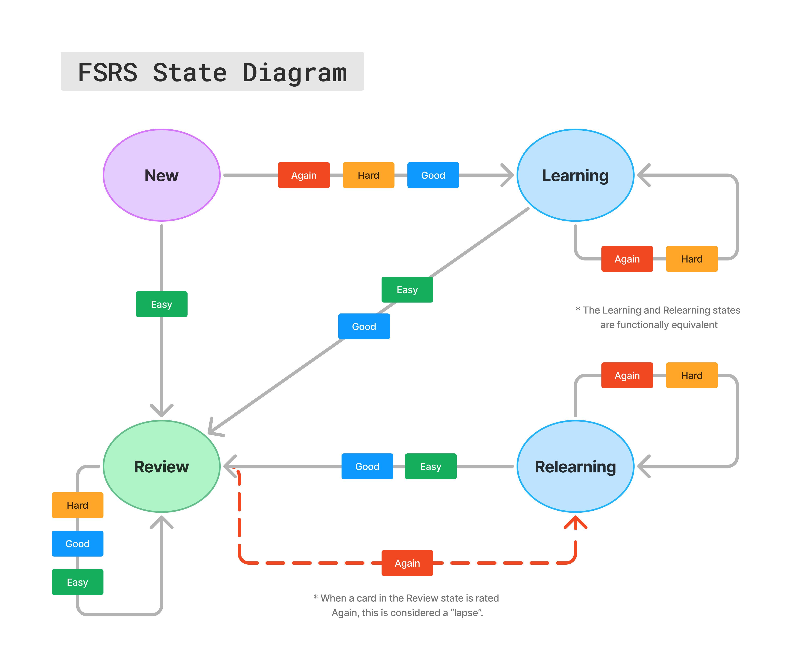

# The FSRS Scheduler Algorithm

## Overview

The FSRS scheduler algorithm is a Markov chain with several state variables and four different transition events. It is based on a variant of the **DSR** (Difficulty, Stability, Retrievability) model which is used to predict human memory states.

## The Algorithm

### Variables

- $DECAY=-0.5,$
- $FACTOR = 0.9^{\frac{1}{DECAY}}-1$,
- $G$: Grade (card rating)
  - $1$: again
  - $2$: hard
  - $3$: good
  - $4$: easy
- State:
  - New
  - Learning
  - Review
  - Relearning
- Scheduler weights: $(w_0, w_1,... w_{18})$
- `HARD_PENALTY` = $w_{15}$
- `EASY_BONUS` = $w_{16}$
- $S$: Stability
- $D$: Difficulty
- $R$: Retrievability (probability of recall)
- $r$: Request retention
- $t$: Days since last review ("elapsed days")
- $I$: Interval ("scheduled days"). Number of days before the card is due next

### Functions

<ins>Initial difficulty</ins>: 

$D_0(G) = w_4-e^{w_5\cdot(G-1)}+1$

<ins>Initial stability</ins>: 

$S_0(G) = w_{G-1}$

<ins>Next interval</ins>: 

$I(r,S) = \frac{S}{FACTOR}\cdot\left(r^{\frac{1}{DECAY}}-1\right)$

<ins>Mean reversion</ins>: 

$MR(a,b) = w_7\cdot a + (1-w_7)\cdot b$

<ins>Short-term stability</ins>: 

$S^\prime(S,G) = S\cdot e^{w_{17}\cdot (G-3+w_{18})}$

<ins>Current retrievability</ins>: 

$R(t,S) = \left(1+FACTOR\cdot \frac{t}{S}\right)^{DECAY}$

<ins>Forget stability</ins>: 

$S^\prime_f(D,S,R) = w_{11} \cdot D^{-12}\cdot \Big[(S+1)^{w_{13}} -1 \Big]\cdot e^{w_{14}\cdot (1-R)}$

<ins>Recall stability</ins>: 

$$S^\prime_r(D,S,R,G) = S\cdot \left[1+e^{w_{8}}\cdot (11-D)\cdot S^{-w_9}\cdot (e^{w_{10}\cdot (1-R)}-1)\cdot \textrm{HARD\_PENALTY(if $G$=2)}\cdot \textrm{EASY\_BONUS(if $G$=4)} \right]$$

### State transitions

**<ins>New card rated Easy:</ins>**

State <- Review

$S=S_0(4)$

$D=D_0(4)$

$I = I(r,S)$

**<ins>New card rated Again / Hard / Good</ins>:**

State <- Learning

$S = S_0(G)$

$D = D_0(G)$

$I = 0$

**<ins>Learning / Relearning card rated Again / Hard:</ins>**

State <- Learning / Relearning

$S = S^\prime(S,G)$

$D = MR\Big(D_0(4), D-w_6\cdot (G-3)\Big)$

$I=0$

**<ins>Learning / Relearning card rated Good / Easy:</ins>**

State <- Review

$S = S^\prime(S,G)$

$D = MR\Big(D_0(4), D-w_6\cdot (G-3)\Big)$

$I = I(r,S)$

**<ins>Review card rated Again:</ins>**

State <- Relearning

$S = S^\prime_f\big(D,S,R(t,S)\big)$

$D = MR\Big(D_0(4), D-w_6\cdot (1-3)\Big)$

$I=0$

**<ins>Review card rated Hard / Good / Easy:</ins>**

State <- Review

$S = S^\prime_r\big(D,S,R(t,S),G\big)$

$D = MR\Big(D_0(4), D-w_6\cdot (G-3)\Big)$

$I = I(r,S)$

## Further reading:

If you are interested in learning more about the FSRS algorithm, you can learn more here:

- [FSRS4Anki Wiki](https://github.com/open-spaced-repetition/fsrs4anki/wiki)
- [A Stochastic Shortest Path Algorithm for Optimizing Spaced Repetition Scheduling](https://dl.acm.org/doi/10.1145/3534678.3539081?cid=99660547150)
- [Optimizing Spaced Repetition Schedule by Capturing the Dynamics of Memory](https://ieeexplore.ieee.org/document/10059206)